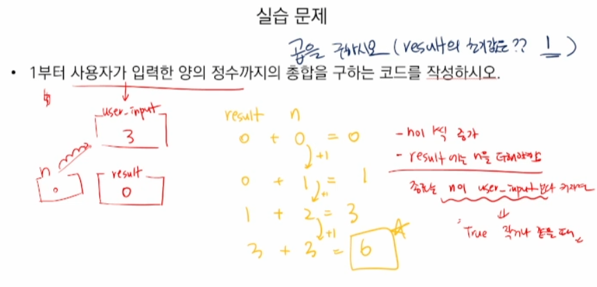
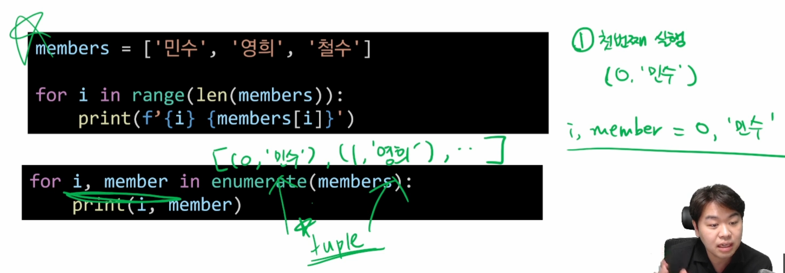

# 반복문

- 특정 조건을 도달할 때까지 계속 반복되는 문장


- while문
  - 종료조건에 해당하는 코드를 통해 반복문 종료
- for문
  - 반복가능한 객체를 모두 순회하면 종료 (별도 종료조건 x)
- 반복 제어
  - break, continue, for-else


## While문

while문은 조건식이 참인 경우 반복적으로 코드 실행

- 조건이 참인 경우 들여쓰기 되어 있는 코드 블록 실행
- 코드 블록 모두 실행되고 다시 조건식을 검사하며 반복적으로 실행
- while문은 무한루프를 하지 않도록 **종료조건이 반드시 필요**


```python 
while <expression>:
    # code block
```


- 이 도식에서 while문은 5번 실행된다 

- 여기서 종료 조건은 `a < 5` 와 `a += 1`


python tutor 에서  while문 실행 절차 시각적으로 확인 가능


실습 문제

1부터 사용자가 입력한 양의 정수까지의 총합을 구하는 코드를 작성하시오

1. 개념 잡기

   

2. 코드 작성

```python 
# 처음 시작 값
n = 0
# 0부터 더하기 위해서
result = 0
# user_input 값
user_input = int(input())

while n <= user_input:
    result += n 		# result에 n을 더해나감
    n += 1 				# n은 1씩 증가
print(result)
```

```python
# 순서가 다른 예

# 처음 시작 값
n = 0
# 0부터 더하기 위해서
result = 0
# user_input 값

user_input = int(input())
while n <= user_input:
    n += 1 				# 처음 시작할 때 더하면서 시작하기 때문에
    result += n			# 입력한 값은 더해지지 않음
print(result)
```

```python
# 헷갈리면 
while n < user_input:
    print(f'n: {n}, result: {result}')
# 를 넣어서 디버깅을 해본다
```


## for문

for문은 시퀀스(str, tuple, list, range)를 포함한 순회가능한 객체(iterable) 요소를 모두 순회함

- 처음부터 끝까지 모두 순회하므로 별도의 종료조건이 필요 없음

```python
for <변수명> in <iterable>: 
     # code block
```


- <iterable> 통에서 꺼내서 <변수명>에 하나하나 넣어준다


### 문자열 순회

- 사용자가 입력한 문자를 한 글자씩 세로로 출력하시오.


- 사용자가 입력한 문자를 range를 활용하여 한 글자씩 출력하시오.

  - index를 기준으로 순회를 한다

  - index 값을 활용할 수 있다는 장점이 있다


### enumerate 순회 (심화)

- **enumerate()**
  - 인덱스와 객체를 쌍으로 담은 열거형enumerate 객체 반환
    - (index, value) 형태의 tuple로 구성된 열거 객체를 반환

​	


### dictionary 순회

- 딕셔너리는 기본적으로 key를 순회하며, key를 통해 값을 활용

  

  - key로 값을 알 수는 있는데 값으로 key를 알 수는 없음
  - 여기서 key는 john, eric

  

  - name = 'john'
  - john 80 ('john', grades['john'])


### while문과 for문의 차이

- while은 true일때 계속 실행되고 false일때 종료

- for은 하나의 통(반복가능한 객체/시퀀스)의 첫번째요소부터 던져줌


## 반복문 제어

- break
  - 반복문을 종료
- continue
  - continue 이후의 코드 블록은 수행하지 않고, 다음 반복을 수행
- for-else
  - 끝까지 반복문을 실행한 이후에 else문을 실행
    - break를 통해 중간에 종료되는 경우 else문은 실행되지 않음


###  break


### continue


### for-else


- else는 for가 끝까지 반복문을 실행하면 실행됨


# 정리


 
