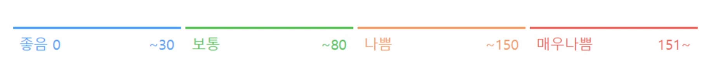

# 조건문

## 조건문

- 순서도

- expression에는 참/거짓에 대한 조건식

```python
if <expression>:

    # run this code block

else <expression>:

     # run this code block
```


- 홀수인지 확인하는 코드
  - a%2 == 1 (a를 2로 나눈 나머지가 1)

```python
# 1. num은 input으로 사용자에게 입력을 받으세요.
num = int(input())
# 2. 조건문을 통해서 홀수/짝수 여부를 출력하세요.
# 숫자로서의 num!
# 3. num>100인지 동시에 확인하세요.
if a%2 == 1 and num > 100 : 
    print('홀수')
else:
    print('짝수')
```


## 복수 조건문

- elif = else if

``` python
if <expression>:
    # code block
elif <expression>:
    # code block
else:
    # code block
```


- 미세먼지 농도에 따른 등급



- dust 값에 따라 등급을 출력하는 조건식을 작성하시오

```python
# 나의 답안
dust = int(input())

if 0 <= dust < 30:
    print('좋음')
elif 30 <= dust < 80:
    print('보통')
elif 80 <= dust < 150:
    print('나쁨')
else:
    print('매우나쁨')
    
# 강사님의 답안
if dust > 150:
    print('매우 나쁨')
elif dust > 80:
    print('나쁨')
elif dust > 30:
    print('보통')
else:
    print('좋음')
print('미세먼지 확인 완료')
```

- else 뒤에는 절대 조건식을 쓰지 않는다 (오류 발생)
  - else는 위의 모든 조건에 해당하지 않는 나머지 경우이기에 별도의 조건 설정 불가
  - else는 반드시 있을 필요는 없으므로 작성 여부는 필요에 따른다

- 위에서부터 하나씩 모든 함수를 지나며 검사를 해나가는 구조이기 때문에 변수의 범위를 N < a < M 이렇게 안 하고 N < a 로만 적어도 된다.
  - 조건식을 동시에 검사하는 것이 아니라 순차적으로 비교


## 중첩 조건문

- 조건문은 다른 조건문에 중첩되어 사용될 수 있음
- 위에서부터 한줄씩 보면서 조건에 맞으면 code block이 실행된다

```python
if <expression>:
    # code block
    if <expression>:
        # code block 
else:
    # code block
```


- 입력값이 음수일 때 '음수 값입니다.' 출력
- 입력값 > 300일 때 '실외활동을 자제하세요.' 출력

```python
# case 1 : 중첩 조건문 사용하기

if dust > 150:
    if dust > 300:
        print('실외활동을 자제하세요.')
    print('매우 나쁨')
elif dust > 80:
    print('나쁨')
elif dust > 30:
    print('보통')
else:
    if dust < 0:
        print('음수 값입니다.')
    else:
        print('좋음')
print('미세먼지 확인 완료')
```


```python
# case 1-1 : 동시 출력

# if dust > 300에 else를 넣으면 미세먼지 등급값이 동시에 출력되지 않으므로
# 동시에 출력하기 위해 else를 적지 않음

if dust > 150:
    if dust > 300:
        print('실외활동을 자제하세요.')
    else:
        print('매우 나쁨')
        
# 이렇게 작성하게 되면 '실외활동을 자제하세요.'와 '매우 나쁨'이 동시에 출력되지 않음 

elif dust > 80:
    print('나쁨')
elif dust > 30:
    print('보통')
else:
    if dust < 0:
        print('음수 값입니다.')
    else:
        print('좋음')
print('미세먼지 확인 완료')
```


```python
# case 2 : 음수를 하나의 elif로 넣기

if dust > 150:
    print('매우 나쁨')
elif dust > 80:
    print('나쁨')
elif dust > 30:
    print('보통')
elif dust > 0:
    print('좋음')
else:
    print('음수 값입니다.')
print('미세먼지 확인 완료')
```


# 조건 표현식

```python
# 조건 표현식
value = num if num >= 0 else - num

# if와 else로 풀어쓰기
#. 1. 양수면 그대로
if num >= 0:
    value  = num
#. 2. 음수면 - 붙여서
else:
    value = -num
    
print(num, value)
```


value라는 곳에 상황에 따라 다른 값을 저장하고 싶을 때
