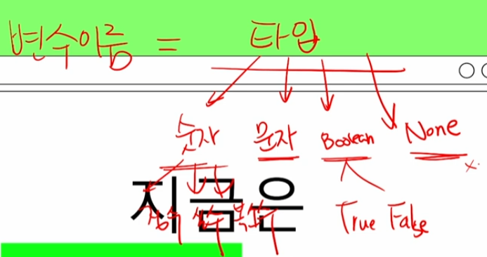
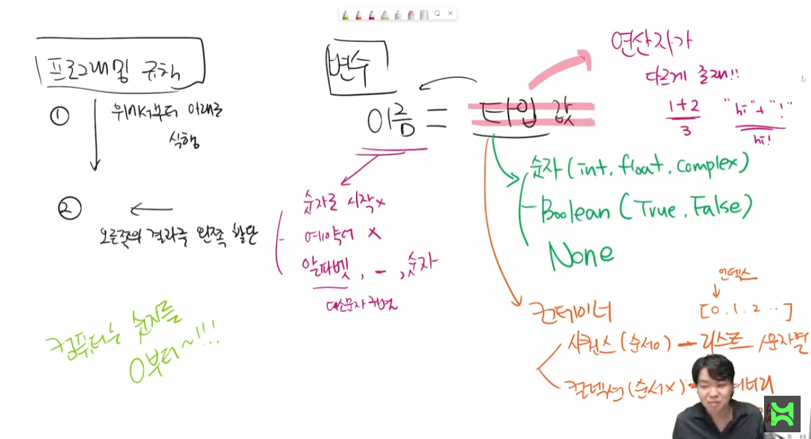

# Python

Python 기본 인터프리터 

- IDLE(Intergrated Development and Learning Environment)

Python 스크립트 실행

- IDE(ex. PyCharm), Text Editor(ex. VS Code) 등에서 작성한 파이썬 스크립트 파일을 직접 실행

## Python 기초 문법

-  

코드 스타일 가이드

일관성 있게 작성하는 것이 중요합니다 (따옴표 '와 ", 띄어쓰기, tab 들여쓰기)

- 코드를 어떻게 작성할지에 대한 가이드라인
- 파이썬에서 제안하는 스타일 가이드
  - PEP8 https://www.python.org/dev/peps/pep-0008/
- 기업, 오픈소스 등에서 사용하는 스타일 가이드
  - 링크

들여쓰기 identation

- space sensitive
  - 문장 구분 시 들여쓰기 indentation 사용
  - 들여쓰기 할 때는 4칸 sapce 4번 혹은 1탭 tab 1번 입력
    - 주의! 한 코드 안에서는 반드시 한 종류의 들여쓰기를 사용 -> 혼용하면 안됨
      -  tab으로 들여 쓰면 계속 탭으로
      - 원칙적으로는 공백 space 사용을 권장 +pep8 권장사항

변수

- variable 
- 컴퓨터 메모리  어딘가에 저장되어 있는 객체를 참조하기 위해 사용되는 이름
  - 객체 object : 숫자 문자 클래스 등 값을 가지고 있는 모든 것
  - ->파이썬은 객체지향 언어이며, 모든 것이 객체로 구현되어 있음
- 동일 변수에 다른 객체를 언제든 할당할 수 있기 때문에,
- 즉 참조하는 객체가 바뀔 수 있기 때문에 '변수'라고 불림

대괄호는 인덱스랑 티접근(?)만. 나머지는 소괄호

print 함수

터미널에서 볼 수 있게 출력

변수 = '의미' -> print(변수)를 의미로 출력

** 코드는 위에서 아래로, 오른쪽에서 왼쪽으로 

변수는 할당연산자=를 통해 값을 할당 assignment

 **type()**

- 변수에 할당된 값의 타입

id() 

- 

변수 연산

한 변수에 두 개 이상 값이 지정됐을 땐 가장 아래에 있는 값으로 적용

문자열 연산은 문자열을 붙여서 연산

변수 할당

같은 값을 동시에 할당할 수 있음

다른 값을 동시에 할당할 수 있음 multiple assignment

두 변수의 값을 바꾸고 싶을 때 임시변수 tmp를 사용

식별자 identifiers

주석 comment

분리형

논리 연산자

참 거짓

수치형 

정수 int

모든 정수의 타입은 int

매우 큰 수를 나타낼 때 오버플로우 발생하지 않음

실수 float

정수가 아닌 모든 실수는 float 타입

부동소수점

- 실수를 컴퓨터가 표현하는 방법 - 2진수/비트 로 숫자 표현
- 이 과정에서 floating point rounding error 발생 ,예상치 못한 결과 발생

산술연산자 arithmetic operator 

// 몫

** 거듭제곱

**% 나머지 (짝수 홀수 확인할 때 주로 쓰임)**

- 3의 배수? 3으로 나눴을 때 나머지가 0
- 짝수홀수? 2로 나눴을때 나머지가 0 1

비교 연산자

<= 이하, >= 이상

== 같음 != 같지않음

(= 할당)

p

문자열 string type

모든 문자는 str 타입

문자열은 '나 "를 활용하여 표기

컴퓨터는 숫자를 0부터 센다

길이-1

 결합 + 반복 * 포함 in

컨테이너

- 리스트
  - students = ['가' '나' '다']
  - print(students[0]) = 가
- 딕셔너리
- 

시퀀스

- 문자열
- 리스트
- 튜플(assignmment 불가)
- 레인지

비시퀀스

- 세트 : 유일한 값들의 모음 collection
- 딕셔너리 : 키-값의 쌍 key-value collection
  - 키는 변경 불가능한 데이터
  - 값은 
    - 키는 거의 문자열, 값은 리스트 str int boolean 등 다양 